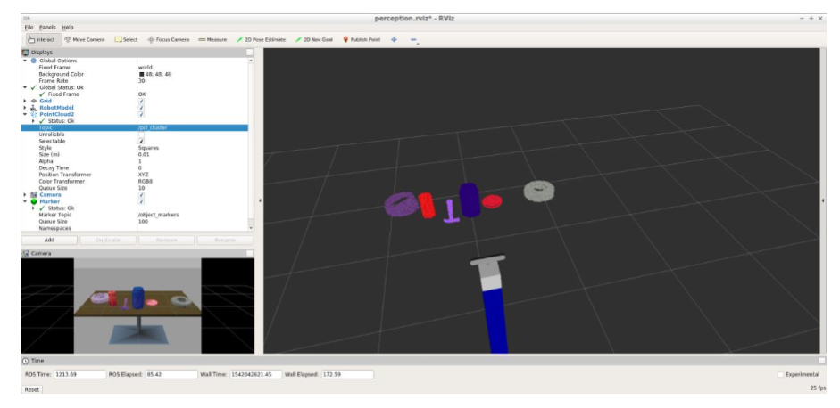
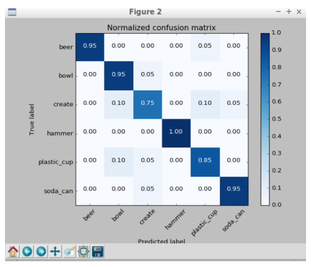
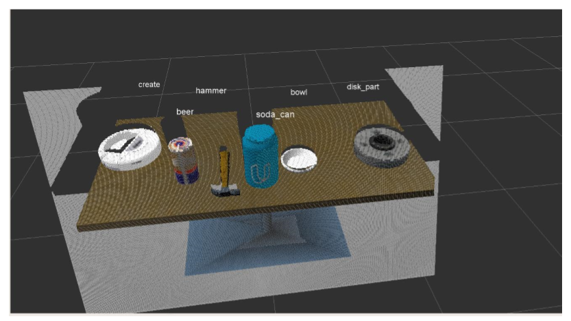
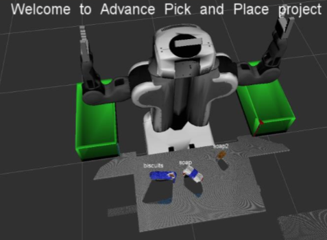
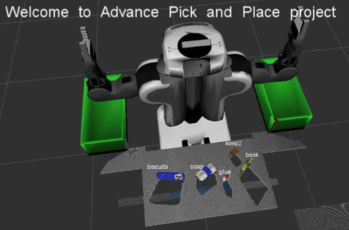
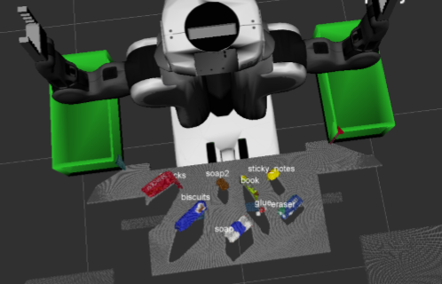

# RoboND_Perception_Project

This is a tabletop pick and place operation project, using a two arm PR2 robot. The project identifies objects in a cluttered environment using the techniques of Clustering, Segmentation and Object Recognition.
## 3D Perception

**Pre-requisites:** [Exercise 1, 2 and 3](https://github.com/udacity/RoboND-Perception-Exercises)from Perception Exercise are needed to be completed before heading towards the project. At the end of Exercise-3 we will have a pipeline that can identify points that belong to a specific object.

The PR2 has been outfitted with a RGB-D sensor which is a bit noisy, much like real sensors.

Given the cluttered tabletop scenario, one must implement a perception pipeline using their work from Exercises 1,2 and 3 to identify target objects from a so-called “Pick-List” in that particular order, pick up those objects and place them in corresponding dropboxes.

## Project Setup

For this setup, catkin_ws is the name of active ROS Workspace:
```sh
$ mkdir -p ~/catkin_ws/src
$ cd ~/catkin_ws/
$ catkin_make
```
Install missing dependencies using rosdep install:
```sh
$ cd ~/catkin_ws
$ rosdep install --from-paths src --ignore-src --rosdistro=kinetic -y
```
Build the project:
```sh
$ cd ~/catkin_ws
$ catkin_make
```
Add following to .bashrc file
```
export GAZEBO_MODEL_PATH=~/catkin_ws/src/RoboND-Perception-Project/pr2_robot/models:$GAZEBO_MODEL_PATH
```
Following line can be added to .bashrc to auto-source all new terminals
```
source ~/catkin_ws/devel/setup.bash
```
Launch the project scenario like this:
```sh
$ roslaunch pr2_robot pick_place_project.launch
```
Once Gazebo is up and running, make sure to see following in the gazebo world:
- Robot

- Table arrangement

- Three target objects on the table

- Dropboxes on either sides of the robot

## Results:

The clustering and segmentation results of Point Cloud Data for table top scenario looks like:

 

The Normalized Confusion Matrix for Table top scenario:

 

The accuracy obtained for object label in Table top Scenario is 100%. This cn be verified with the following diagram:

 

pick_list1.yaml includes: [object_list:- name: biscuits, group: green, - name: soap, group: green, - name: soap2, group: red]
The accuracy obtained for object labels from pick_list_1.yaml is 100%.

 

pick_list_2.yaml includes: [object_list: - name: biscuits, group: green, - name: soap, group: green, - name: book, group: red, - name: soap2, group: red, - name: glue, group: red].The accuracy obtained for object labels from pick_list_2.yaml is again 100%.

 

pick_list_3.yaml includes: [object_list: - name: sticky_notes, group: red, - name: book, group: red, - name: snacks, group: green, - name: biscuits, group: green, - name: eraser, group: red, - name: soap2, group: green, - name: soap, group: green- name: glue, group: red].The accuracy obtained for object labels from pick_list_3.yaml is also 100%.

 
